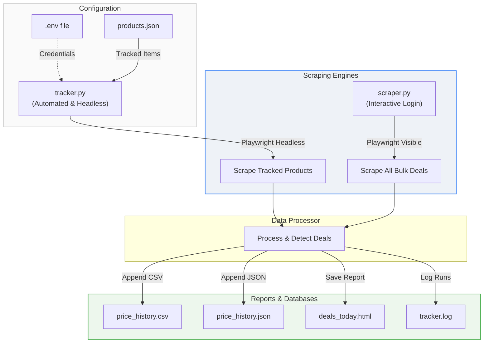

# 🦅 SGProof Deal Tracker

[](https://www.python.org/downloads/)
[](https://playwright.dev/python/)
[](https://opensource.org/licenses/MIT)

An automated and interactive price-tracking suite for **shop.sgproof.com**. It monitors prices, logs historical data, detects promo deals, and generates beautiful responsive HTML reports that you can open directly in your web browser.

---

## 📐 Architecture & Workflow

Here is how the tracking suite handles scraping and report generation:



---

## 🛠️ The Scraping Modes

This repository provides **three main scripts** tailored to different tracking needs:

| Script | Mode | Authentication | Goal / Function | Key Outputs |
| :--- | :--- | :--- | :--- | :--- |
| [tracker.py](file:///Users/priyanshsuthar/Downloads/sgproof_tracker/tracker.py) | Automated | Headless / Auto | Tracks specific products from `products.json` daily. | `deals_today.html`, `price_history.csv`, `tracker.log` |
| [scraper.py](file:///Users/priyanshsuthar/Downloads/sgproof_tracker/scraper.py) | Interactive | Manual Browser | Scrapes *all* deals on the site and filters for **small bundles** (under 12 bottles). | `deals_today.html`, `price_history.json` |
| [debug_login.py](file:///Users/priyanshsuthar/Downloads/sgproof_tracker/debug_login.py) | Debug | Headless / Auto | Troubleshoots age gates, market selectors, and login inputs. | `stepX_*.png` screenshots |

---

## 🚀 Getting Started

### 1. Installation & Environment Setup
Ensure you have Python 3.8+ installed. Then run:

```bash
# Navigate inside the repository directory
cd sgproof_tracker

# Create and activate a virtual environment
python3 -m venv .venv
source .venv/bin/activate  # On Windows: .venv\Scripts\activate

# Install dependencies
pip install -r requirements.txt
playwright install chromium
```

### 2. Configure Credentials
Copy the sample environment file and enter your SGProof credentials:

```bash
cp .env.example .env
```

Open `.env` in your editor:
```env
SGPROOF_EMAIL=your_sgproof_email@example.com
SGPROOF_PASSWORD=your_sgproof_password
```

> [!WARNING]
> Never commit your `.env` file to GitHub! It is listed in `.gitignore` to keep your credentials secure.

---

## 📈 Running the Tracker & Scraper

### Option A: Automated Tracker (`tracker.py`)
This script uses the credentials in your `.env` to automatically log in and fetch prices for products specified in `products.json`.

1. **Add your target products** in [products.json](file:///Users/priyanshsuthar/Downloads/sgproof_tracker/products.json):
   ```json
   [
     {
       "name": "Tito's Handmade Vodka 1.75L",
       "url": "https://shop.sgproof.com/sgws/en/usd/search?q=tito%27s+1.75",
       "category": "Vodka",
       "notes": "Best seller"
     }
   ]
   ```
2. **Execute the script**:
   ```bash
   python tracker.py
   ```
3. **Open the report**:
   - **macOS**: `open deals_today.html`
   - **Windows**: `start deals_today.html`

---

### Option B: Interactive Deal Finder (`scraper.py`)
This script searches for all volume/tier deals currently running on SGProof, filterable for smaller order quantities (bundles under 12 units).

1. **Execute the script**:
   ```bash
   python scraper.py
   ```
2. **Interactive Steps**:
   - A browser window will open.
   - Confirm the 21+ age gate, select your region/state, and log in manually.
   - Return to the terminal and **press Enter** to start the automatic crawling.
3. **Open the report**:
   ```bash
   open deals_today.html
   ```

---

### Option C: Troubleshooting Login (`debug_login.py`)
If SGProof changes their front-end login structure and automated runs fail:
```bash
python debug_login.py
```
This runs step-by-step with visual screenshots (`step1_homepage.png`, etc.) saved directly in the project directory so you can inspect where the flow gets stuck.

---

## ⏰ Scheduling Automated Runs (Daily)

### macOS / Linux (using `cron`)
To run `tracker.py` automatically every morning at 8:00 AM:

1. Open your crontab editor:
   ```bash
   crontab -e
   ```
2. Add the following line (make sure to replace paths with your actual project directory and virtual environment Python binary):
   ```cron
   0 8 * * * cd /Users/priyanshsuthar/Downloads/sgproof_tracker && /Users/priyanshsuthar/Downloads/sgproof_tracker/.venv/bin/python tracker.py
   ```

### Windows (using Task Scheduler)
1. Open the **Task Scheduler**.
2. Click **Create Basic Task...** and name it `SGProof Price Tracker`.
3. Choose **Daily** and set the start time (e.g., `8:00 AM`).
4. Select **Start a Program** as the action.
5. In **Program/script**, enter the path to your Python interpreter (e.g. `C:\path\to\sgproof_tracker\.venv\Scripts\python.exe`).
6. In **Add arguments**, enter `tracker.py`.
7. In **Start in**, enter the path to the workspace folder (e.g. `C:\path\to\sgproof_tracker`).

---

## 📁 Repository Structure

```text
├── .env                  # Local environment file (ignored by git)
├── .env.example          # Template for email/password credentials
├── .gitignore            # Git ignore rules for virtualenv, logs, & db files
├── README.md             # This premium guide
├── requirements.txt      # Project dependencies
├── products.json         # Search queries & products config to track
├── scraper.py            # Manual login / bulk bundle deals crawler
├── tracker.py            # Automated tracked products monitor
├── debug_login.py        # Login diagnostician
├── deals_today.html      # Responsive generated daily HTML report (ignored)
├── price_history.csv     # Running database for tracker.py (ignored)
└── price_history.json    # Running database for scraper.py (ignored)
```

---

## 📄 License

This project is licensed under the MIT License. Feel free to modify and adapt it to your wholesale tracking needs.
